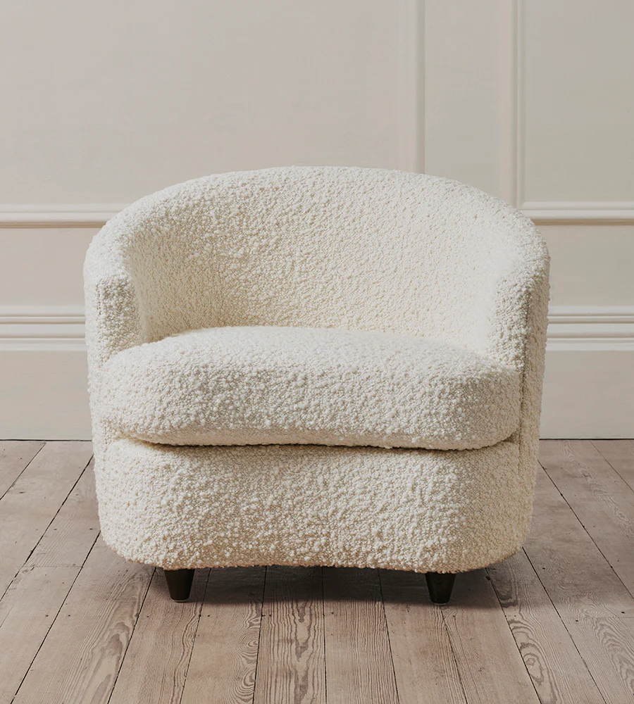
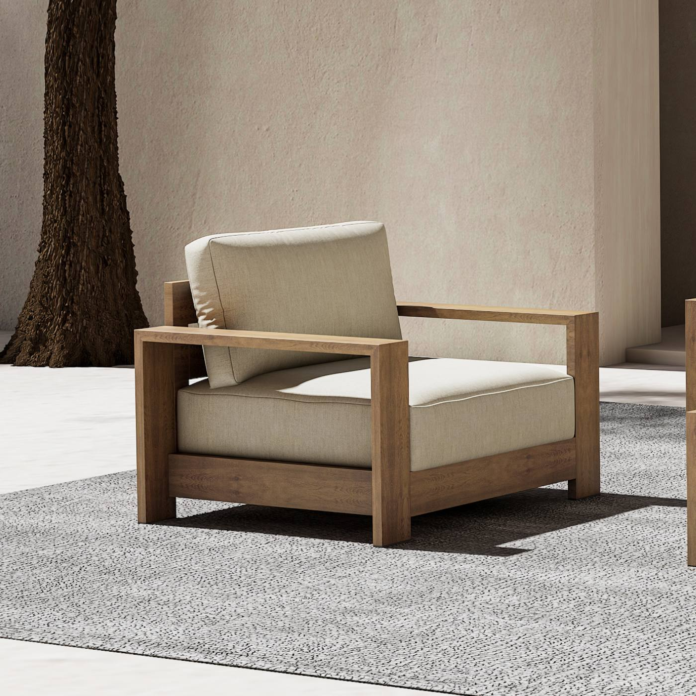
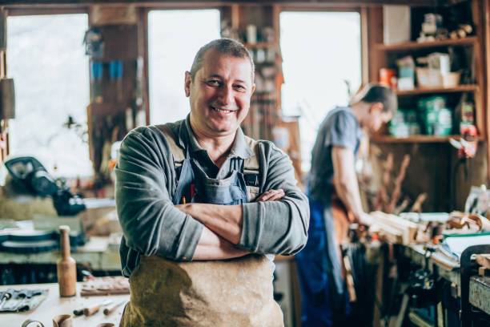
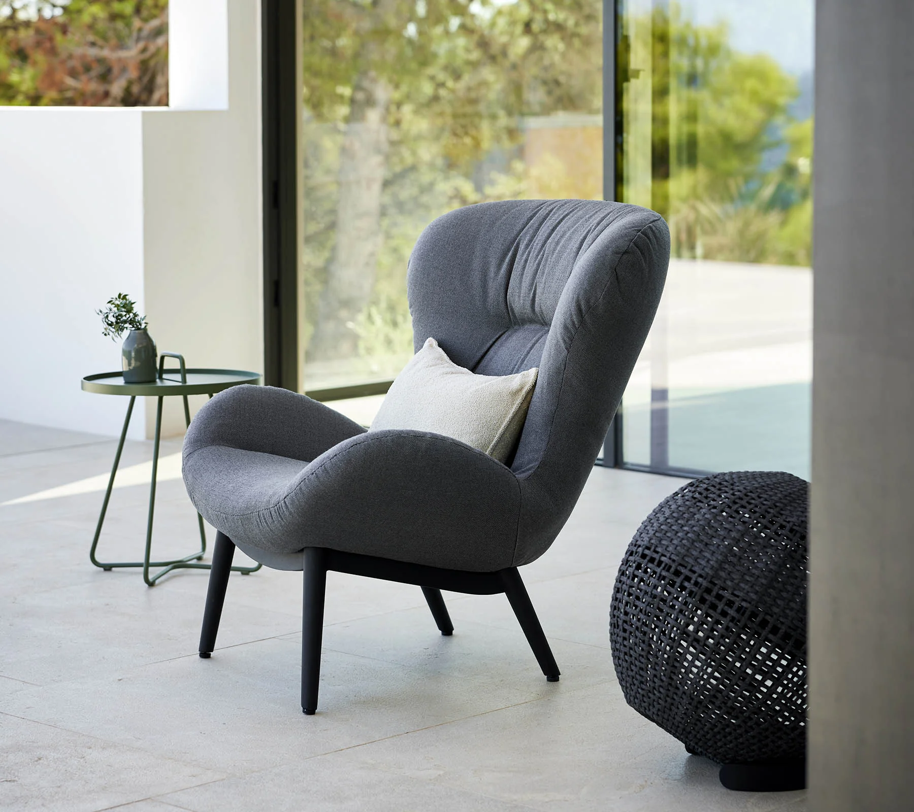

# Guia de Integração de Imagens

## 📍 Localização das Imagens

Todas as imagens devem estar na pasta `/images`:

```
images/
├── leather.webp
├── linen_chair.webp
├── poltrona_boucle.webp
├── suede_chair.webp
├── wood_arm_chair.jpg
├── worker.jpg
└── web_done.png
```

## 🖼️ Como Integrar Imagens no HTML

### Exemplo 1: Imagem na Seção Hero (com fallback)
```html
<div class="hero-visual">
  
</div>
```

### Exemplo 2: Imagem com Picture Element (responsive)
```html
<picture>
  <source 
    srcset="images/leather.webp" 
    type="image/webp"
  />
  <source 
    srcset="images/leather.jpg" 
    type="image/jpeg"
  />
  
</picture>
```

### Exemplo 3: Imagem na Galeria (com grid responsivo)
```html
<div class="galeria-item">
  
  <span class="galeria-label">Estrutura em Madeira Maciça</span>
</div>
```

### Exemplo 4: Background Image em CSS
```css
.hero-visual {
  background-image: url('images/poltrona_boucle.webp');
  background-size: cover;
  background-position: center;
  background-attachment: fixed; /* Parallax effect */
}
```

## 📸 Atributos Importantes

### `loading="lazy"`
Carregamento preguiçoso melhor performance:
```html

```

### `srcset` para Imagens Responsivas
```html

```

### `sizes` para Different Viewports
```html

```

## 🎨 Padrões de EStilos CSS para Imagens

### Imagem Responsiva Básica
```css
.imagem-responsiva {
  max-width: 100%;
  height: auto;
  display: block;
}
```

### Imagem com Aspect Ratio Fixo
```css
.imagem-galeria {
  width: 100%;
  aspect-ratio: 4 / 3;
  object-fit: cover;
  border-radius: var(--raio);
}
```

### Imagem com Overlay
```css
.imagem-com-overlay {
  position: relative;
  overflow: hidden;
}

.imagem-com-overlay::after {
  content: '';
  position: absolute;
  inset: 0;
  background: rgba(0, 0, 0, 0.3);
  opacity: 0;
  transition: opacity var(--transicao);
}

.imagem-com-overlay:hover::after {
  opacity: 1;
}

.imagem-com-overlay img {
  width: 100%;
  height: 100%;
  object-fit: cover;
}
```

### Imagem com Zoom ao Hover
```css
.imagem-zoom {
  overflow: hidden;
  border-radius: var(--raio);
}

.imagem-zoom img {
  width: 100%;
  height: auto;
  transition: transform 0.6s ease;
}

.imagem-zoom:hover img {
  transform: scale(1.05);
}
```

## 🔍 Otimização de Imagens

### Formatos Recomendados
- **WebP**: Melhor compressão (poltrona_boucle.webp)
- **JPEG**: Fotos com muitos tons (wood_arm_chair.jpg)
- **PNG**: Imagens simples com transparência

### Dimensões Recomendadas
- **Hero Image**: 1200x800px ou 1920x1080px
- **Galeria Grid**: 600x400px ou 800x600px
- **Thumbnail**: 300x200px
- **Ícones**: 64x64px a 256x256px

### Compressão
Recomendamos ferramentas como:
- TinyPNG/TinyJPG
- ImageOptim
- Squoosh.app
- ffmpeg (para WebP)

## 💡 Dicas de Performance

1. **Lazy Loading**: Use `loading="lazy"` em imagens abaixo da viewport
2. **WebP com Fallback**: Sempre inclua fallback para browsers antigos
3. **Picture Element**: Para art direction (diferentes imagens por tamanho)
4. **CSS Background vs IMG Tag**: 
   - `` para conteúdo
   - CSS background para decoração
5. **Compressão**: Comprima antes de fazer upload
6. **CDN**: Considere usar CDN para servir imagens em produção

## 📂 Exemplo de Estrutura Expandida

Se quiser organizar melhor:
```
images/
├── hero/
│   ├── poltrona-principal.webp
│   └── poltrona-principal@2x.webp
├── galeria/
│   ├── couro-tabaco.webp
│   ├── boucle-marfim.webp
│   └── madeira-nogueira.jpg
├── sobre/
│   ├── artesao.jpg
│   └── oficina.webp
└── social/
    ├── og-image.png
    └── favicon.ico
```

Atualize os caminhos no HTML conforme necessário:
```html

```

---

**Última atualização**: 3 de março de 2025
